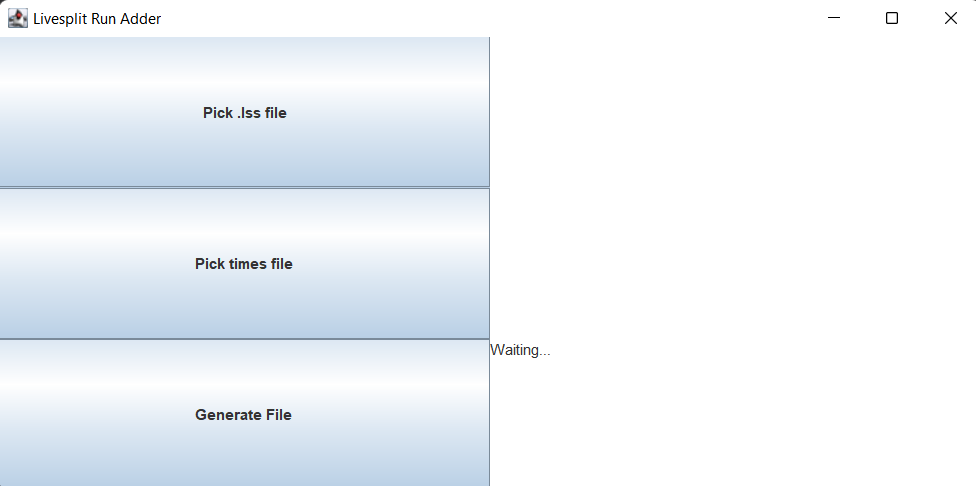

# LiveSplitAddRun

This program allows you to add a run to your .lss file by inserting a list of times.



### How to use

Create a .txt file containing each time as a new line with hours, minutes, and seconds as shown. For example:
``` 
00:00:40
00:01:20
00:20:50
...
10:32:59
```

Have your .lss file ready.

Run the .jar file. Select the .txt and .lss files with the provided buttons. Click "Generate File" to generate the new .lss file.
It will be generated in the same directory as the original .lss file with the name "\<old file name\>_updated.lss"
